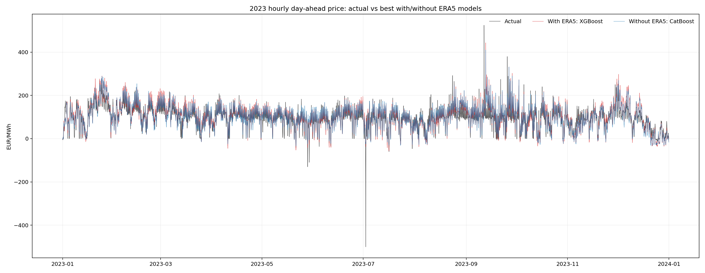
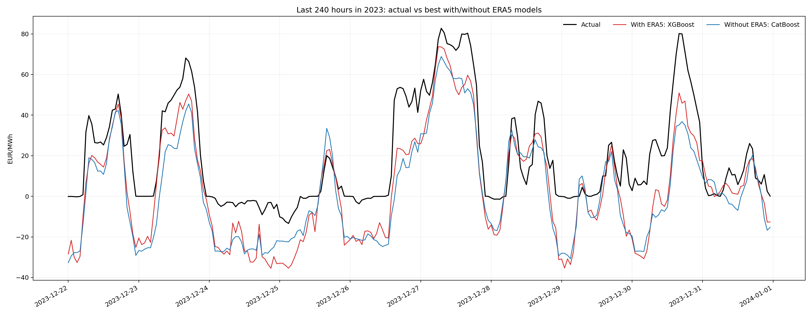
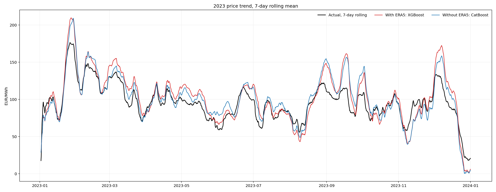
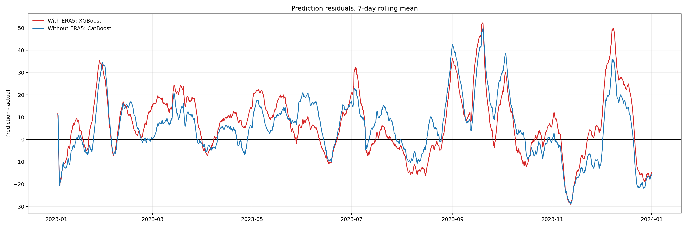
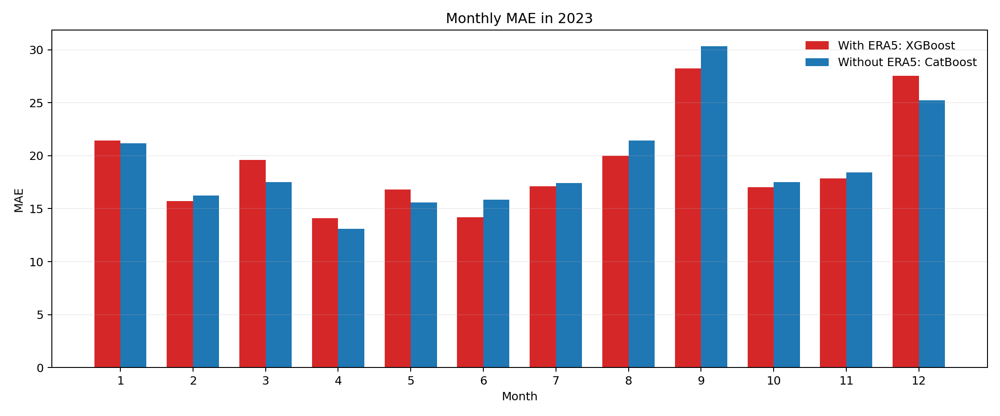
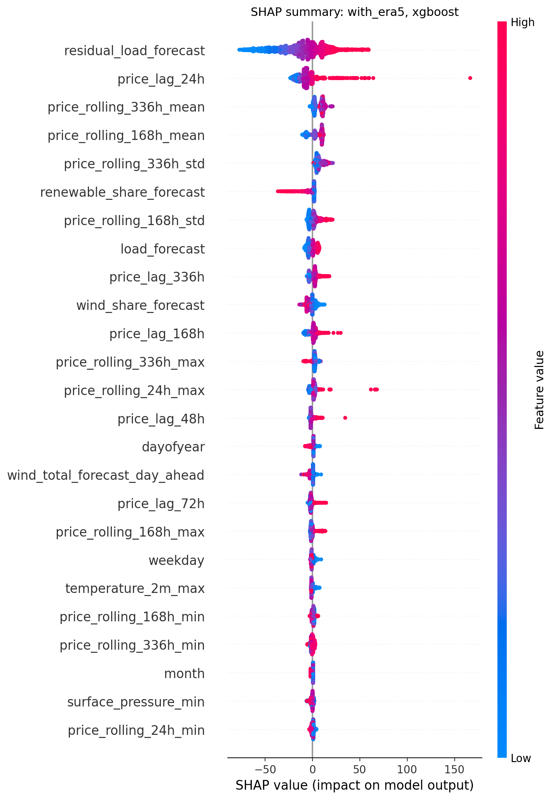
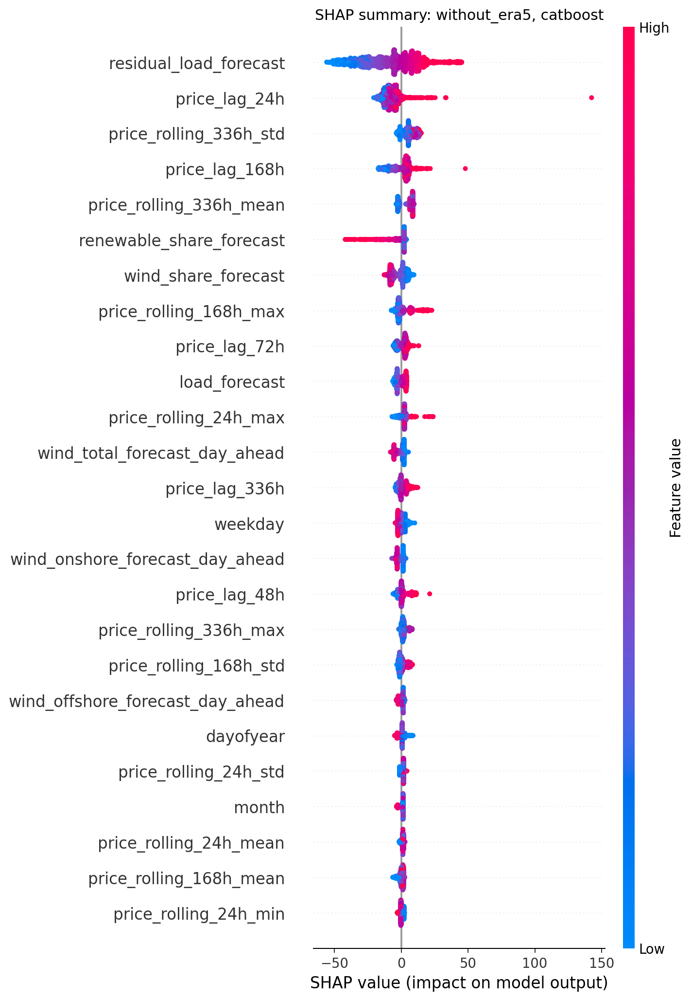
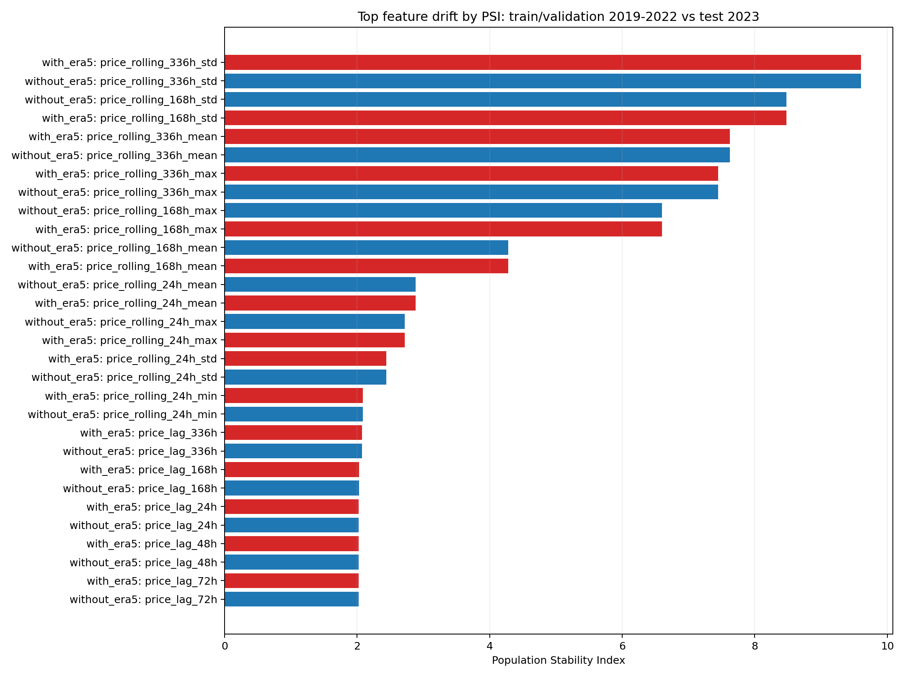

# electricity_price_prediction

德国/Luxembourg bidding zone 日前电价小时级预测项目。项目目标是跑通一个完整的电价预测流程，并客观评估 ERA5 气象再分析数据对电价预测的边际贡献。

这里的“日前电价预测”指的是：在今天市场出清前，预测明天 24 个小时分别对应的电价。模型表按小时展开，因此测试集中每一行对应 2023 年某个小时的 day-ahead price。

## 项目结论概览

本项目比较了两组特征：

- `with ERA5`：历史电价、日历、负荷/新能源预测、PVGIS-SARAH3、ERA5 气象再分析特征。
- `without ERA5`：去掉 ERA5，保留其他默认特征。

正式实验设置：

- 训练/验证：2019-2022
- 测试：2023
- 粒度：1 小时
- 调参：每个主要模型随机搜索 `max_trials=10`
- 模型：ElasticNet、XGBoost、LightGBM、CatBoost、LSTM、RNN、OOF stacking
- 主要指标：MAE、RMSE、SMAPE、R2、方向准确率、负电价 precision/recall、高价前 10% MAE

全局最优结果几乎打平：

| 特征组 | 最优模型 | MAE | RMSE | 方向准确率，lag24 | 负电价召回率 | 高价前10% MAE |
| --- | --- | ---: | ---: | ---: | ---: | ---: |
| with ERA5 | XGBoost | 19.1792 | 26.4897 | 0.7450 | 0.7567 | 97.2037 |
| without ERA5 | CatBoost | 19.1754 | 26.1358 | 0.7553 | 0.6700 | 98.8439 |

`with ERA5 - without ERA5` 的最优 MAE 差值约为 `+0.0038`，可以认为在全年平均 MAE 上没有显著差异。

但分模型看，ERA5 并非没有价值：

| 模型 | MAE with ERA5 | MAE without ERA5 | delta | 说明 |
| --- | ---: | ---: | ---: | --- |
| XGBoost | 19.1792 | 19.3120 | -0.1328 | ERA5 小幅提升 |
| LightGBM | 19.7003 | 20.4938 | -0.7934 | ERA5 提升明显 |
| ElasticNet | 20.1027 | 20.4528 | -0.3501 | ERA5 小幅提升 |
| LSTM | 20.2677 | 22.3757 | -2.1080 | ERA5 对 LSTM 提升最大 |
| CatBoost | 20.9432 | 19.1754 | +1.7679 | ERA5 反而变差 |
| RNN | 23.1357 | 21.7342 | +1.4015 | ERA5 反而变差 |

负数表示加入 ERA5 后 MAE 下降。结论是：ERA5 对部分模型有效，但不是“加入气象变量就稳定提升”。在已有负荷预测、风电预测、光伏预测等市场侧特征时，ERA5 的边际贡献会被这些特征吸收一部分。

## 核心可视化

完整图集见：

[reports/figures/era5_ablation_max10](reports/figures/era5_ablation_max10)

详细可视化报告见：

[reports/modeling/era5_ablation_max10_visual_report.md](reports/modeling/era5_ablation_max10_visual_report.md)

### 2023 全年小时级趋势

全年小时级曲线非常密集，适合观察整体 regime 和尖峰，但不适合看局部拟合细节。



### 最后 240 小时短窗口

短窗口更适合检查模型是否跟得上局部趋势、日内形状和尖峰。



### 7 天滚动趋势

滚动趋势用于观察模型是否有系统性偏高或偏低。



### 残差趋势



### 月度 MAE



### SHAP Summary

红色表示该特征取值较大，蓝色表示该特征取值较小。横轴是 SHAP value，表示该特征对预测电价的正向或负向贡献。

with ERA5 最优模型 XGBoost：



without ERA5 最优模型 CatBoost：



两个模型的 SHAP 都显示，最重要的变量主要是：

- `residual_load_forecast`：残余负荷预测，是电价最核心的供需压力变量。
- `price_lag_24h`、`price_lag_168h`：昨天同小时、上周同小时价格。
- `price_rolling_*`：历史电价均值、波动率、最大值，捕捉价格 regime。
- `renewable_share_forecast`、`wind_share_forecast`：新能源占比相关变量。
- `load_forecast`：负荷预测。

这说明电价预测里，市场供需变量和历史价格 regime 仍然是主导信息。气象变量的价值更可能体现在特定场景，例如高风、高光伏、低残余负荷、负电价、价格尖峰和天气突变。

## 气象数据分析：ERA5 的价值与局限

本项目使用 ERA5 的风、热力、云、太阳辐射相关变量，并把德国区域内网格气象数据聚合成小时级特征。实验结果说明：

1. ERA5 对某些模型有帮助，尤其是 LightGBM、XGBoost、ElasticNet、LSTM。
2. ERA5 对 CatBoost 和 RNN 在本次设置下反而造成性能下降。
3. 全年平均 MAE 上，最优 with/without ERA5 基本打平。

这不是“气象数据无用”，而是说明当前 ERA5 使用方式有局限：

- ERA5 是 reanalysis，再分析数据，偏向事后重建的真实大气状态，不是交易时点真实可获得的预报数据。
- 日前电价预测应使用“今天能拿到的明天天气预报”，而不是事后再分析天气。
- 当前 ERA5 是区域统计聚合，没有按风电、光伏装机空间分布加权，可能稀释局部有效信号。
- 数据里已有负荷预测、风电预测、光伏预测，这些变量本身已经吸收了大量气象信息。
- ERA5 变量多且相关性强，可能给高容量模型带来噪声、冗余和过拟合。
- 2023 年电价 regime 与 2019-2022 差异较大，历史价格滚动特征存在显著漂移。

### 如果有实时卫星数据，可能如何改进

如果能提供实时或准实时卫星气象数据，潜在改进点会比 ERA5 更贴近日前/实时业务：

- **信息时点更真实**：使用交易前可获得的卫星观测和临近预报，避免 reanalysis 的事后信息问题。
- **云与辐照更直接**：光伏预测对云场、云移动、云光学厚度、辐照变化高度敏感，卫星云图可以提供更高频、更直接的观测。
- **空间分辨率更高**：如果结合光伏/风电装机分布加权，卫星数据可能比区域平均 ERA5 更有效。
- **短时突变更敏感**：卫星云图序列可用于 nowcasting，提升未来数小时光伏和局地天气变化预测。
- **改善功率预测再传导到电价**：卫星数据未必直接进入电价模型效果最好，更合理的链路是先改进风光功率预测，再通过 residual load、renewable share 等变量传导到电价预测。
- **场景价值更明显**：实时卫星数据可能主要改善负电价、高光伏午间低价、高风出力、尖峰前后、天气快速变化等特定场景，而不是平均 MAE。

面试中可以客观表述为：

> 当前实验表明，直接加入 ERA5 reanalysis 特征并不会稳定提升全年电价 MAE。但这不否定气象数据的价值，因为 ERA5 存在信息时点和空间聚合局限。若公司拥有实时卫星观测和自建气象数据库，更合理的方向是构建交易时点可用的高分辨率气象特征，先提升新能源功率预测和 residual load 预测，再评估其对电价尖峰、负电价和高波动时段的增益。

## 特征漂移



漂移最强的是历史电价滚动统计，尤其是 rolling volatility、rolling mean、rolling max。这说明 2023 年价格分布与 2019-2022 训练/验证期差异明显。对于电价预测，这是一个很重要的业务风险：模型可能学到历史价格 regime，但遇到新的能源价格、政策、供需结构时泛化能力下降。

## 项目结构

```text
configs/
  modeling_config.json
scripts/
  train_tabular_models.py
  train_lstm_full.py
  visualize_era5_ablation.py
reports/
  modeling/
    era5_ablation_max10_summary.csv
    era5_ablation_max10_model_comparison.csv
    era5_ablation_max10_visual_report.md
    era5_ablation_max10_shap_importance_*.csv
    era5_ablation_max10_feature_drift_psi.csv
  figures/
    era5_ablation_max10/
data/
  predictions/
    era5_ablation_*_test_predictions_2023.csv
```

原始数据和中间处理数据体积较大，且 ERA5 下载依赖个人账号，本仓库默认不上传 `data/raw/` 与 `data/processed/`。复现实验时需要按 `DATA_CATALOG.md` 和脚本重新下载或准备数据。

## 运行方式

环境依赖包括：

- Python 3.9+
- pandas、numpy、scikit-learn
- xgboost、lightgbm、catboost
- torch
- shap
- matplotlib

训练正式消融实验：

```bash
bash scripts/run_era5_ablation_max10.sh
```

生成可视化与 SHAP：

```bash
python3 scripts/visualize_era5_ablation.py
```

## 相关说明文档

- [DATA_CATALOG.md](DATA_CATALOG.md)
- [PROJECT_PLAN.md](PROJECT_PLAN.md)
- [ENVIRONMENT_CHECK.md](ENVIRONMENT_CHECK.md)

# 新能源功率预测与电价预测面试准备

本文面向云遥宇航“电力预测算法”岗位准备，重点解释两个相关但不同的问题：

- 新能源功率预测：预测风电、光伏在未来某个时间段会发多少电。
- 电价预测：预测电力市场中某个区域、节点或交易品种在未来某个时间段的价格。

两者的关系是：气象影响风光出力，风光出力影响供需平衡，供需平衡进一步影响电价。对拥有卫星气象数据的公司来说，核心机会在于把“更高时空分辨率的气象观测和预报”转化为“更准确的新能源出力预测”和“更有交易价值的电价预测”。

## 1. 总体业务链路

一个完整链路通常是：

```text
卫星观测 / 地面站 / NWP数值天气预报 / 历史功率 / 市场数据
        ↓
气象数据库建设：清洗、质控、反演、插值、时空对齐、特征工程
        ↓
风电/光伏功率预测：未来15分钟、1小时、日前、数日的出力预测
        ↓
系统供需预测：负荷、可再生能源、火电/水电/核电、储能、外送通道
        ↓
电价预测：日前价格、实时价格、分区/节点价格、价差、尖峰风险
        ↓
交易决策：报价、持仓、套利、风险控制、辅助调度
```

面试中可以强调：电价预测不是孤立的时间序列问题，而是气象、负荷、新能源出力、机组边际成本、输电约束和市场规则共同作用的结果。

## 2. 新能源功率预测

### 2.1 概念解释

新能源功率预测是指预测风电场、光伏电站或区域新能源集群在未来某个时间尺度上的发电功率。

常见预测尺度：

- 超短期：未来15分钟到4小时，服务实时调度、功率控制、现货交易滚动修正。
- 短期：未来4小时到72小时，服务日前市场、调度计划、备用安排。
- 中长期：未来数天到数月，服务发电量评估、资产运营、策略研究。

风电和光伏的区别：

- 风电主要受风速、风向、空气密度、湍流、地形、机组状态影响。
- 光伏主要受太阳辐照度、云量、温度、湿度、气溶胶、积雪/沙尘、组件状态影响。

### 2.2 风电功率预测

风电功率的物理基础可以简化为：

```text
P ≈ 0.5 × ρ × A × Cp × v³
```

其中：

- `P`：风机输出功率。
- `ρ`：空气密度，受温度、气压、湿度影响。
- `A`：叶轮扫风面积。
- `Cp`：风能利用系数。
- `v`：轮毂高度风速。

最重要的一点是：风功率近似与风速三次方相关，所以风速误差会被显著放大。比如风速预测偏差不大，也可能导致功率预测明显偏差。

核心变量：

- 气象变量：轮毂高度风速、风向、温度、气压、湿度、空气密度、边界层高度、湍流强度、风切变。
- 空间变量：经纬度、海拔、地形粗糙度、坡度、周边障碍物、风机排布。
- 设备变量：风机型号、额定功率、切入风速、额定风速、切出风速、可用状态、限电状态。
- 历史运行变量：历史功率、历史风速、历史预测误差、爬坡事件、弃风记录。
- 时间变量：小时、季节、天气型、节假日通常不是直接影响风，但会影响限电和调度。

典型难点：

- NWP预报的是网格风速，不一定等于风机轮毂高度的真实风速。
- 山地、海上、峡谷等复杂地形会造成局地风场偏差。
- 风电功率曲线有非线性和饱和区间。
- 限电、检修、故障会让“实际功率”低于“可发功率”，训练时必须区分。
- 爬坡事件，也就是短时间内大幅增减出力，对调度和交易影响很大。

### 2.3 光伏功率预测

光伏功率的核心驱动是辐照度，可以简化理解为：

```text
光伏功率 ≈ 有效辐照度 × 装机容量 × 系统效率 × 温度修正 × 可用率
```

核心变量：

- 辐照变量：全球水平辐照度 `GHI`、直接法向辐照度 `DNI`、散射水平辐照度 `DHI`、晴空指数。
- 云相关变量：云量、云顶高度、云光学厚度、云移动方向和速度。
- 气象变量：温度、湿度、气压、风速、降水、能见度、气溶胶、沙尘。
- 太阳几何变量：太阳高度角、方位角、日出日落时间、季节。
- 电站变量：装机容量、组件朝向、倾角、逆变器效率、组件温度、遮挡、积雪、清洗状态。
- 历史运行变量：历史功率、历史辐照度、历史预测误差、限电和检修状态。

典型难点：

- 云的生成、移动和消散对分钟级光伏波动影响极大。
- 光伏日内曲线强烈受太阳高度角约束，有明显的昼夜边界。
- 组件温度升高会降低转换效率，所以晴热天气并不总是最优。
- 沙尘、积雪、污染、遮挡会造成气象条件与实际功率不一致。
- 大规模分布式光伏的装机、位置和实时出力不一定完全可观测。

### 2.4 数据来源

新能源功率预测通常会用多源数据：

- 卫星数据：云图、云顶温度、云光学厚度、辐照估计、GNSS掩星反演的大气温湿压廓线、海风场等。
- NWP数值天气预报：ECMWF、GFS、GRAPES、WRF等模型输出的风速、温度、气压、湿度、辐照、云量、降水等。
- 地面观测：气象站、测风塔、辐照仪、场站SCADA、PMU、电表。
- 场站信息：装机容量、机组型号、逆变器信息、地理位置、地形、风机排布。
- 电网运行数据：限电、检修、并网点功率、调度指令。

对于云遥宇航这类公司，卫星数据的价值主要体现在：

- 补足地面站稀疏地区的观测。
- 提供更高覆盖范围的云、辐照、温湿压、海风场等信息。
- 通过数据同化改善NWP初始场，从源头提升天气预报质量。
- 在区域级新能源预测中构建统一的气象底座。

### 2.5 常用模型

物理模型：

- 风电：基于NWP风速订正、轮毂高度外推、空气密度修正、风机功率曲线建模。
- 光伏：基于太阳位置、晴空模型、辐照分解、组件温度模型和逆变器效率模型。

统计与机器学习模型：

- 线性回归、岭回归、Lasso：可解释性强，适合作基线。
- Random Forest、GBDT、XGBoost、LightGBM、CatBoost：工业界常用，适合表格特征和非线性关系。
- SVR、KNN：小数据场景可用，但大规模工业系统较少作为主力。

深度学习模型：

- LSTM、GRU：处理时间序列和历史滞后特征。
- TCN：用卷积建模时间依赖，训练稳定。
- Transformer、Informer、Autoformer、PatchTST等：适合长序列、多变量预测。
- CNN + LSTM：适合云图、雷达图、时序数据融合。
- GNN：适合风电场站、区域电网、空间站点之间的图结构建模。

组合模型：

- NWP + 机器学习误差订正。
- 物理功率曲线 + 残差模型。
- 多NWP集合预报 + 模型集成。
- 点预测 + 分位数预测/概率预测。

### 2.6 评价指标

常见指标：

- `MAE`：平均绝对误差，直观稳定。
- `RMSE`：对大误差更敏感。
- `MAPE`：低功率时容易失真，新能源场景需谨慎。
- `nMAE / nRMSE`：按装机容量归一化，便于跨场站比较。
- `R²`：解释方差能力。
- 分位数损失、CRPS：用于概率预测。
- 爬坡事件命中率、漏报率、误报率：用于风险场景。

实际业务中，单纯平均误差不够，还要关注：

- 高风、高辐照、高出力时段误差。
- 突变天气和爬坡事件误差。
- 限电、检修、异常数据是否被正确识别。
- 预测提前量越长，误差如何增长。

### 2.7 行业前沿

新能源功率预测的前沿方向包括：

- 概率预测：从给一个点值，转向给置信区间或分位数，服务备用容量和交易风险管理。
- 集合预报：融合多个NWP、多个起报时次、多个模型，提升稳定性。
- 卫星云图临近预报：利用卫星图像追踪云团运动，提升分钟级到小时级光伏预测。
- AI气象模型：盘古、风乌、GraphCast等数据驱动天气模型推动气象预报加速，未来会和新能源预测深度结合。
- 多模态融合：把卫星图像、NWP网格、地面站、SCADA、地形、机组状态统一建模。
- 空间建模：用GNN、时空Transformer建模场站之间的天气传播和功率相关性。
- 可解释与可运营：不仅预测功率，还解释误差来自气象偏差、设备异常、限电还是模型失效。

## 3. 电价预测

### 3.1 概念解释

电价预测是指预测电力市场中的交易价格，例如日前市场价格、实时市场价格、节点边际电价、分区电价、月度或年度合约价格等。

它与普通商品价格不同，因为电力有几个特殊性：

- 难以大规模低成本存储，必须实时平衡。
- 供需变化极快，价格可能出现尖峰、负电价或剧烈波动。
- 输电线路有容量约束，不同地点价格可能不同。
- 市场规则、机组报价、调度约束会直接影响价格。
- 新能源边际成本低，但波动性强，会压低部分时段价格，也会增加灵活性需求。

### 3.2 电价类型

常见预测对象：

- 日前电价：提前一天形成，通常按小时或15分钟出清。
- 实时电价：临近实际运行时形成，更受预测误差、故障和短时波动影响。
- 节点边际电价 `LMP`：反映某节点供电的边际成本，包含能量、阻塞、损耗等成分。
- 分区电价：区域内统一价格，常见于部分电力市场。
- 价差：如日前-实时价差、区域价差、峰谷价差。
- 尖峰事件：预测价格是否超过某阈值，比点预测更像分类或风险预测问题。

### 3.3 核心变量

电价预测变量可以分为六大类。

需求侧：

- 系统负荷预测。
- 温度、湿度、体感温度、极端高温/寒潮。
- 小时、星期、节假日、工业生产周期。
- 数据中心、充电负荷、电采暖等新增负荷。

供给侧：

- 风电预测、光伏预测、水电来水、核电计划、火电可用容量。
- 各类机组边际成本和报价。
- 机组检修、故障停机、启停约束、爬坡约束。
- 储能充放电行为。

燃料与碳成本：

- 煤价、天然气价格、油价。
- 碳价、环保成本。
- 燃料库存和运输约束。

电网约束：

- 跨区联络线功率。
- 输电断面约束。
- 阻塞情况。
- 区域外送/受入能力。

市场行为：

- 历史日前价、实时价、成交量。
- 报价曲线、供需曲线。
- 市场集中度、发电商策略。
- 辅助服务价格。

政策与规则：

- 价格上限/下限。
- 现货市场规则。
- 中长期合约比例。
- 新能源消纳、限电、绿证、容量电价等机制。

### 3.4 新能源如何影响电价

新能源对电价的影响不是简单的“新能源越多，电价越低”，而是分时段、分区域、分约束条件变化。

主要机制：

- 边际成本低：风光出力高时，会挤出高边际成本火电或燃气机组，压低市场出清价格。
- 波动性强：当风光出力突然下降，需要高成本灵活电源补位，价格可能尖峰。
- 午间低价：高光伏渗透地区容易出现午间低价甚至负价。
- 傍晚爬坡：日落后光伏快速下降，而负荷仍高，容易形成高价时段。
- 阻塞加剧：新能源基地远离负荷中心时，输电约束会导致区域价差。
- 弃风弃光：如果电网无法消纳，实际价格信号会受限电和市场规则影响。

面试中可以用一句话概括：新能源提高了电价预测对气象预测的依赖，也提高了价格的波动性和尖峰风险。

### 3.5 数据来源

电价预测需要的数据比功率预测更复杂：

- 市场数据：历史日前价、实时价、成交量、报价、出清结果、辅助服务价格。
- 负荷数据：历史负荷、负荷预测、分区负荷。
- 新能源数据：风电/光伏实际出力、预测出力、装机容量、限电信息。
- 常规电源数据：火电、水电、核电、气电可用容量、检修计划、故障信息。
- 气象数据：温度、湿度、风速、辐照、降水、极端天气预警。
- 燃料数据：煤、气、油价格和库存。
- 电网数据：联络线计划、断面约束、阻塞信息。
- 日历数据：小时、星期、节假日、调休、重大活动。

数据工程重点：

- 明确时间粒度：15分钟、30分钟、小时、日。
- 严格避免数据泄露：预测日前价格时，只能使用当时可获得的信息。
- 对齐发布时间：NWP、负荷预测、市场公告、检修计划发布时间不同。
- 区分预测值和真实值：交易时可用的是预测负荷、预测风光，而不是事后真实值。
- 处理异常价：价格上限、负价、尖峰价不能简单删除，因为它们往往最有业务价值。

### 3.6 常用模型

统计模型：

- AR、ARIMA、SARIMA：适合强周期的价格序列基线。
- VAR：建模价格、负荷、新能源等多变量关系。
- GARCH：建模价格波动率。
- 分位数回归：预测价格区间和风险。

机器学习模型：

- XGBoost、LightGBM、CatBoost：电价预测工业界非常常用，适合表格特征、非线性和特征交互。
- Random Forest：稳健但外推能力一般。
- Elastic Net：可解释性好，适合与基本面变量结合。

深度学习模型：

- LSTM、GRU：建模价格时序依赖。
- TCN：适合多步预测。
- Transformer类模型：适合长序列、多变量、跨区域预测。
- N-BEATS、N-HiTS：强时间序列基线。
- 时序基础模型：TimesFM、Moirai、MOMENT、TTM等开始被用于电价预测研究，但工业落地通常还要结合业务特征和规则约束。

基本面/仿真模型：

- 供给曲线模型：根据机组边际成本和可用容量构建供给曲线，与负荷相交得到价格。
- 生产成本模型：模拟机组组合、经济调度、输电约束。
- 混合模型：用基本面模型给出结构，再用机器学习修正残差。

实际推荐：

- 基线：历史同小时均值、SARIMA、LightGBM。
- 主力：LightGBM/XGBoost + 丰富基本面特征。
- 提升：加入风光功率预测、负荷预测、燃料价格、检修、联络线、天气异常。
- 风险：再做分位数预测或尖峰分类。

### 3.7 评价指标

点预测指标：

- `MAE`：常用且稳健。
- `RMSE`：更关注尖峰误差。
- `MAPE`：价格接近0或负价时不适用。
- `sMAPE`：相对误差替代方案，但解释性仍有限。

风险预测指标：

- 分位数损失：评价P10/P50/P90等预测。
- Pinball Loss：分位数预测常用。
- 尖峰命中率、召回率、误报率。
- 交易回测收益：比纯误差指标更贴近业务。
- 最大回撤、夏普比率、盈亏比：交易策略指标。

注意：电价预测的业务目标未必是最低MAE。如果用于交易，更重要的可能是方向判断、尖峰识别、价差排序和风险控制。

### 3.8 行业前沿

电价预测的前沿方向包括：

- 从点预测转向概率预测：给出价格分布，支持风险定价。
- 从单区域预测转向跨区域预测：建模联络线、阻塞、区域价差。
- 从纯数据驱动转向基本面 + 机器学习混合：提高可解释性和极端场景稳定性。
- 更重视新能源和天气变量：风光渗透率越高，气象误差对价格误差的传导越明显。
- 尖峰和负价建模：价格极端值虽然少，但对交易收益和风险影响最大。
- 图模型和因果建模：把电网拓扑、区域耦合、输电约束纳入模型。
- 时序基础模型应用：用于快速迁移到新市场、新区域，但仍需要市场规则和业务特征增强。

## 4. 气象数据库应该怎么理解

HR提到“建立自己的气象数据库”，这不是简单存天气数据，而是建立一个能服务预测建模的时空数据底座。

核心能力包括：

- 多源接入：卫星、NWP、地面站、SCADA、市场、电网数据。
- 时空统一：不同数据源的时间粒度、空间分辨率、坐标系不同，需要统一到场站、区域或网格。
- 质量控制：异常值、缺测、漂移、重复、延迟、单位不一致。
- 数据版本：预测业务必须保留“当时看到的预报版本”，不能只存事后修正值。
- 特征服务：为模型稳定提供风速、辐照、云量、温度、历史误差等特征。
- 评估闭环：记录预测结果、真实结果、误差归因和模型版本。

一个比较成熟的数据表设计思路：

```text
weather_observation      实况气象观测
weather_forecast         NWP预报，带起报时间和预测时效
satellite_product        卫星反演产品
station_power_actual     场站实际功率
station_power_forecast   场站功率预测结果
market_price_actual      市场真实价格
market_price_forecast    电价预测结果
asset_metadata           场站、机组、装机、地理信息
grid_constraint          联络线、断面、阻塞、限电信息
model_registry           模型版本、特征版本、训练数据窗口
```

其中最容易被忽略但非常重要的是：

- `forecast_issue_time`：预报发布时间。
- `target_time`：预测目标时间。
- `lead_time`：预测提前量。
- `data_available_time`：数据实际可用时间。

这些字段决定了模型是否存在数据泄露。

## 5. 面试中可以这样表达

### 5.1 对新能源功率预测的表达

新能源功率预测本质是气象驱动的时空预测问题。风电对轮毂高度风速特别敏感，光伏对辐照度和云变化特别敏感。工程上不能只看历史功率，还要融合NWP、卫星、地面站和场站SCADA数据。模型上我会先建立物理或经验基线，再用LightGBM、时序模型或时空模型做误差订正，同时区分正常发电、限电、检修和异常数据。评价时除了MAE/RMSE，也要关注爬坡事件和概率区间。

### 5.2 对电价预测的表达

电价预测不是单纯预测价格曲线，而是预测市场供需平衡下的出清结果。关键变量包括负荷、新能源出力、常规机组可用容量、燃料价格、联络线约束和市场规则。新能源渗透率提高后，气象误差会通过风光出力传导到电价，造成低价、负价、尖峰价和区域价差。因此我会采用基本面特征 + 机器学习模型的方式，并进一步做分位数预测和尖峰风险识别，最后用交易回测检验模型价值。

### 5.3 对云遥宇航岗位的表达

云遥宇航的优势在于自有卫星气象数据。如果把卫星观测、GNSS掩星反演、NWP预报和地面站数据融合起来，构建可追溯、可版本化、可服务模型训练的气象数据库，就可以在风光功率预测和电价预测中形成数据优势。我的理解是，这个岗位的关键不是只调一个模型，而是把气象数据质量、时空对齐、预测目标定义、业务评价指标和模型迭代闭环打通。

## 6. 常见面试问题

### Q1：为什么风电功率预测比普通时间序列预测难？

因为风电功率由气象和设备共同决定，风速误差会被三次方关系放大。同时复杂地形、风机尾流、限电、检修、故障都会让历史功率和真实可发能力不一致。

### Q2：为什么光伏预测要关注卫星云图？

光伏短时波动主要来自云。卫星云图可以提供云的位置、移动方向、云顶温度、云光学厚度等信息，对分钟级到小时级光伏预测尤其有价值。

### Q3：做电价预测时能不能直接用真实负荷和真实风光出力？

训练和离线分析可以用真实值做上限实验，但真实预测时不能用未来真实值。工程上必须使用当时可获得的负荷预测、风光预测和市场公告，否则会发生数据泄露。

### Q4：为什么新能源多了以后电价波动会变大？

风光边际成本低，会在高出力时压低价格；但当风光突然下降或预测偏差较大时，系统需要更昂贵的灵活电源补位，价格可能快速升高。高光伏地区还容易出现午间低价、傍晚高价。

### Q5：模型效果很好，为什么交易不一定赚钱？

预测误差指标和交易收益不是一回事。交易还受手续费、报价规则、风险限额、流动性、偏差考核和极端价格影响。交易模型更关注方向、价差、尖峰和风险收益比。

## 7. 建议学习路线

第一阶段：理解电力系统与市场

- 学习负荷、发电、调度、备用、输电约束。
- 理解日前市场、实时市场、节点电价、分区电价。
- 了解新能源消纳、弃风弃光、限电、辅助服务。

第二阶段：理解气象与新能源

- 风电：风速、风向、空气密度、功率曲线、轮毂高度。
- 光伏：GHI、DNI、DHI、云量、太阳高度角、组件温度。
- NWP：起报时间、预测时效、网格插值、集合预报。

第三阶段：掌握建模

- 表格模型：LightGBM、XGBoost、CatBoost。
- 时序模型：SARIMA、LSTM、TCN、Transformer、N-BEATS。
- 概率预测：分位数回归、Pinball Loss、CRPS。
- 时空建模：CNN、GNN、时空Transformer。

第四阶段：做一个小项目

- 用公开天气数据和电力数据做光伏/风电预测。
- 用负荷、风光、历史价格做日前电价预测。
- 做严格时间切分，避免数据泄露。
- 输出误差分析和可解释性分析。

## 8. 参考资料

- 云遥宇航官网：https://tjyyspace.com/
- NREL Solar and Wind Forecasting：https://www.nrel.gov/grid/solar-wind-forecasting
- IEA Electricity 2025：https://www.iea.org/reports/electricity-2025
- IEA Electricity Mid-Year Update 2025：https://www.iea.org/reports/electricity-mid-year-update-2025
- 中国气象局关于社会化观测数据产品与商业卫星资料应用的公开资料：https://www.cma.gov.cn/
- ENTSO-E Transparency Platform：https://transparency.entsoe.eu/

## 9. 大型电价预测竞赛参考

### 9.1 GEFCom2014 电价预测赛道

GEFCom 是 Global Energy Forecasting Competition，属于能源预测领域非常有影响力的公开竞赛系列。GEFCom2014 包含负荷、电价、风电、光伏四个赛道，共吸引了来自61个国家的581名参赛者。电价赛道要求参赛者预测某一区域未来24小时的电价概率分布，也就是提交多个分位数，而不是只提交一个点预测值。

数据特点：

- 预测目标：某个电力市场区域的 locational marginal price，也就是节点/位置边际电价。
- 时间粒度：小时级。
- 预测尺度：未来24小时。
- 历史数据：约3年的小时级电价。
- 外生变量：区域负荷预测、系统负荷预测。
- 特点：主办方故意把数据做得相对简单，没有提供机组停运、输电阻塞、燃料价格等更复杂的市场数据，以便更多数据科学选手参与。

优胜队伍方法：

- 第一名 Tololo：
  - 使用分位数回归、广义加性模型 `GAM`。
  - 同时尝试自回归模型、随机森林、GBM、核分位数回归。
  - 对价格尖峰做了部分预处理。
  - 使用预测组合方法 `ML-Poly aggregation`。
- Team Poland：
  - 使用带外生变量的自回归模型、过滤方法、分位数回归和人工判断修正。
  - 使用三类过滤：日期类型过滤、相似负荷曲线过滤、期望偏差过滤。
  - 最终用算术平均做模型组合。
- GMD：
  - 使用前馈神经网络。
- C3 Green Team：
  - 使用分位数回归、径向基函数网络、k-means、ADMM优化和带外生变量的自回归模型。

关键经验：

- 前四名中有三支队伍使用了分位数回归，说明电价预测不能只看点预测，概率预测很重要。
- 简单模型加上精心设计的特征、尖峰处理和模型组合，可以超过单一复杂模型。
- 电价尖峰是核心难点，很多队伍会单独处理异常高价或极端价格。

### 9.2 EEM2016 MIBEL 实时电价预测竞赛

EEM2016 EPF competition 是 2016 年欧洲能源市场会议相关的电价预测竞赛，由 INESC TEC 和 Smartwatt 合作推出，运行在 COMPLATT 平台上。它更接近真实业务：参赛者每天滚动提交伊比利亚电力市场 MIBEL 未来5天、共120小时的现货价格点预测。

数据特点：

- 预测目标：MIBEL 日前市场小时电价。
- 时间粒度：小时级。
- 预测尺度：未来5天，即120小时。
- 历史数据：2015年小时级数据，并在竞赛期间每日滚动更新。
- 市场数据：历史市场电价。
- 负荷数据：葡萄牙、西班牙电力需求，西班牙需求预测。
- 发电数据：水电、风电、火电、核电、煤电、天然气、光伏、热电联产、与法国交换功率等。
- 新能源预测：西班牙风电预测。
- 气象预测：伊比利亚半岛网格点的风速、风向、温度、辐照度、降水。
- 日历特征：小时、星期等。
- 允许使用额外公开数据，更贴近真实预测环境。

参赛与方法特点：

- 共有44个预测器参与。
- 最强的预测器多来自专业交易或行业团队，因为他们使用了更完整的数据和业务经验。
- 学术团队即使只使用部分公开数据，通过神经网络和高级预测方法，也能接近最好预测器的效果。
- 后续研究表明，把多个竞赛预测器做集成，再用 Beta 分布构造概率预测，是一种有效的后处理方式。

关键经验：

- 电价预测高度依赖“基本面变量”：需求、发电结构、风光、水电、跨区交换和天气。
- 预测天数越远，误差越大。
- 专业团队的优势不一定是模型更炫，而是数据更全、特征更贴近市场机制。
- 模型集成在电价预测中非常常见，因为单模型对市场制度变化和尖峰价格容易失效。

### 9.3 对面试的启发

从这些竞赛可以总结出几条面试观点：

- 电价预测中，`LightGBM/XGBoost/随机森林/神经网络/自回归/GAM/分位数回归` 都可能有效，但胜负通常取决于数据、特征、验证方式和集成。
- 如果只用历史价格，模型很容易学到周期性，但很难解释价格尖峰。
- 新能源占比越高，风光预测、气象预测、负荷预测对电价预测越重要。
- 竞赛中常见的优秀方案不是单一深度学习模型，而是“基本面特征 + 多模型 + 分位数/概率预测 + 尖峰处理”。
- 对云遥宇航这样的公司，自有卫星气象数据如果能改善风光出力和天气特征，就可能进一步改善电价预测，尤其是极端天气和新能源高波动时段。

## 10. 公开数据项目方案

如果目标是“跑通电价预测，并探究卫星气象数据的贡献”，推荐优先做欧洲市场，尤其是德国、西班牙或丹麦。原因是欧洲电力市场数据开放程度高，电价、负荷、风光发电、跨区交换、气象和卫星辐照数据都能公开获取。

### 10.1 最推荐方案：欧洲日前电价预测

项目目标：

- 预测某个国家或 bidding zone 的日前电价。
- 对比三组模型：
  - 只用历史电价和日历特征。
  - 加入电力基本面：负荷、风电、光伏、发电结构、跨区交换。
  - 再加入卫星/再分析气象特征：辐照度、云、温度、风速等。
- 用误差下降、尖峰识别能力、特征重要性和分时段表现来评估气象/卫星数据贡献。

推荐市场：

- 德国 `DE-LU`：新能源占比高，光伏和风电影响明显，负价和尖峰都比较多。
- 西班牙 `ES`：光伏、水电、风电都重要，PVGIS/SARAH 卫星辐照数据覆盖好。
- 丹麦 `DK1/DK2`：风电占比高，适合研究风速和跨区交换对价格的影响。

数据源：

- ENTSO-E Transparency Platform：
  - 日前电价。
  - 负荷实际值和负荷预测。
  - 风电、光伏实际发电和预测。
  - 分技术类型发电量。
  - 跨区交换、输电容量。
- Open Power System Data `OPSD`：
  - 已清洗好的欧洲时间序列数据。
  - 包含负荷、电价、风电/光伏发电和部分容量数据。
  - 适合快速开始，不必一开始就处理 ENTSO-E API 的复杂细节。
- Copernicus ERA5：
  - 2m温度、100m风速、10m风速、总云量、低/中/高云量、表面太阳辐射、降水等。
  - ERA5 是再分析数据，同化了卫星和地面观测，不是纯卫星，但适合做气象底座。
- PVGIS / SARAH：
  - European Commission JRC 的 PVGIS 可提供小时级太阳辐照和 PV 发电模拟。
  - PVGIS-SARAH 基于 EUMETSAT CM SAF 的 SARAH 卫星太阳辐射数据，适合用来代表“卫星辐照数据”。
- EUMETSAT CM SAF SARAH-3：
  - 更原始、更专业的卫星太阳辐射数据，NetCDF 格式。
  - 适合进阶版本；入门阶段优先用 PVGIS API 更省事。

建议时间范围：

- 2019-2024 年：既覆盖新能源较高渗透时期，又避开太老的市场结构。
- 如果担心疫情和能源危机造成结构突变，可做两个版本：
  - 训练 2019-2022，测试 2023。
  - 训练 2021-2023，测试 2024。

### 10.2 数据拼接粒度

建议以小时为主键：

```text
timestamp_utc
country_or_zone
day_ahead_price
load_actual
load_forecast
wind_generation_actual
wind_generation_forecast
solar_generation_actual
solar_generation_forecast
generation_by_type
net_import
temperature_2m
wind_speed_10m
wind_speed_100m
ghi_or_surface_solar_radiation
cloud_cover
precipitation
calendar_features
```

注意：

- 电价一般用本地市场时区发布，但建模建议统一转为 UTC，再派生本地小时。
- 日前预测必须避免数据泄露。预测某日 D 的电价时，只能使用 D-1 当时可获得的数据。
- 如果用 ERA5 或 PVGIS 的历史实况数据，它们不是真实交易时可提前获得的预报，因此第一版可以作为“气象解释变量价值上限”；第二版再换成天气预报数据做真实 ex-ante 预测。

### 10.3 卫星气象数据贡献怎么验证

建议做消融实验：

```text
Baseline A:
历史电价 + 日历特征

Baseline B:
A + 负荷预测 + 风光预测 + 发电结构

Weather C:
B + ERA5 气象变量

Satellite D:
B + PVGIS/SARAH 卫星辐照变量

Full E:
B + ERA5 + PVGIS/SARAH
```

比较指标：

- `MAE`、`RMSE`：整体误差。
- 高价时段 MAE：只看价格最高的10%小时。
- 低价/负价识别：分类准确率、召回率。
- 尖峰召回率：价格超过阈值的事件是否被提前识别。
- SHAP / permutation importance：看辐照、云量、风速是否真的被模型使用。
- 分小时误差：看卫星辐照是否改善午间光伏高发时段。
- 分季节误差：看冬季风电、夏季光伏是否有不同贡献。

### 10.4 可选方案：美国市场

美国也可以做，但比欧洲复杂：

- PJM / CAISO / ERCOT 都有公开市场数据。
- NREL NSRDB 有卫星反演的 `GHI`、`DNI`、`DHI`，适合光伏相关分析。
- NOAA GOES 卫星、HRRR、GFS 等气象数据可用，但数据工程复杂度更高。

适合方向：

- PJM 节点/区域 LMP 预测。
- CAISO 光伏高渗透下的日前/实时价差预测。
- ERCOT 风电和极端天气导致的价格尖峰预测。

缺点：

- LMP、节点、分区、拥塞、燃料、停机数据拼接更复杂。
- 卫星原始数据体量大，入门成本高。

### 10.5 不推荐作为第一版的数据

- 中国现货电价数据：公开完整度较低，市场规则和数据口径不统一。
- 原始卫星云图直接建模：价值高，但下载、投影、裁剪、时空对齐和图像建模成本大。
- 只用 Kaggle 小数据集：容易跑模型，但很难体现卫星气象数据的贡献。

### 10.6 最小可行项目

第一版可以这样做：

1. 选择德国 `DE-LU` 或西班牙 `ES`。
2. 从 OPSD 下载小时级电价、负荷、风电、光伏数据。
3. 从 PVGIS API 拉取几个代表性城市或新能源集中区域的小时级太阳辐照和温度。
4. 从 ERA5 拉取区域平均温度、风速、云量。
5. 构造三个模型：
   - 历史价格 + 日历。
   - 加电力基本面。
   - 加气象/卫星变量。
6. 用 LightGBM 做主模型，SARIMA 或历史同小时均值做基线。
7. 用 SHAP 和消融实验说明卫星/气象变量贡献。

这个项目足够支撑面试表达：不是只会调模型，而是能把数据可得性、业务逻辑、气象变量、市场机制和模型评估串起来。

### 10.7 当前本地数据状态

已下载第一版项目数据，详见 `DATA_CATALOG.md`。

本地数据范围：

- 区域：德国/卢森堡 `DE-LU`
- 粒度：小时级
- 时间：2019-01-01 00:00 UTC 到 2023-12-31 23:00 UTC
- 每条完整序列行数：43,824

已下载数据：

- SMARD：日前电价、实际负荷、负荷预测、风电/光伏实际发电、风电/光伏日前预测。
- PVGIS-SARAH3：Berlin、Hamburg、Munich、Frankfurt、Cologne 五个代表点的小时级卫星辐照数据。
- Open-Meteo：同五个代表点的温度、风速、云量、降水、短波辐射等天气变量。

说明：官方 Copernicus ERA5 需要配置 `~/.cdsapirc` 和安装 `cdsapi`。当前环境没有 CDS 凭据，所以第一版先使用 Open-Meteo 作为无需账号的历史天气补充，PVGIS-SARAH3 作为卫星辐照数据主来源。
