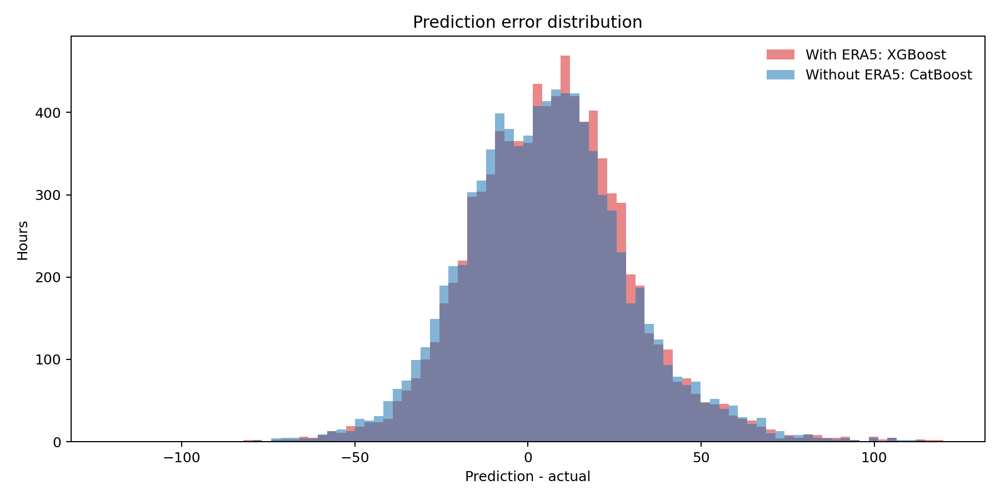
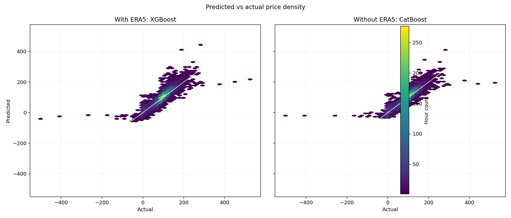
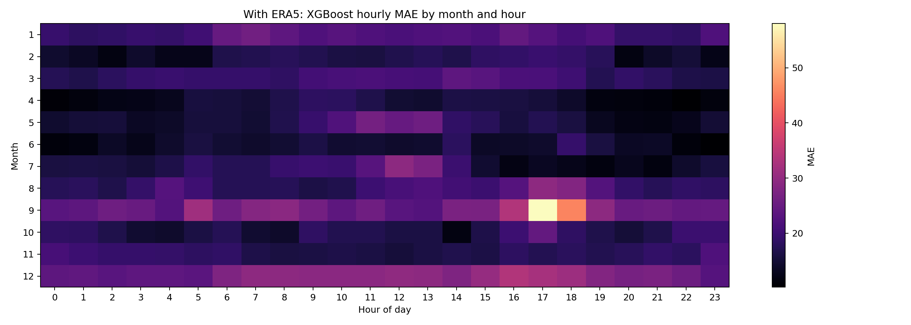
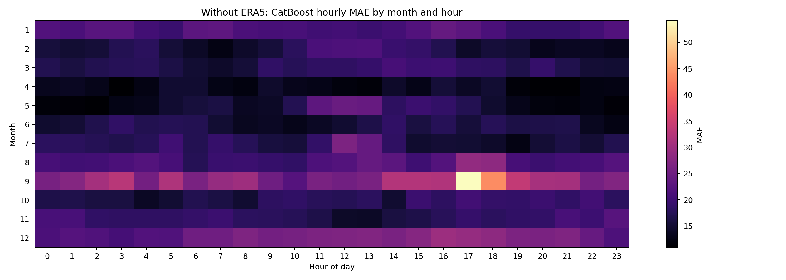
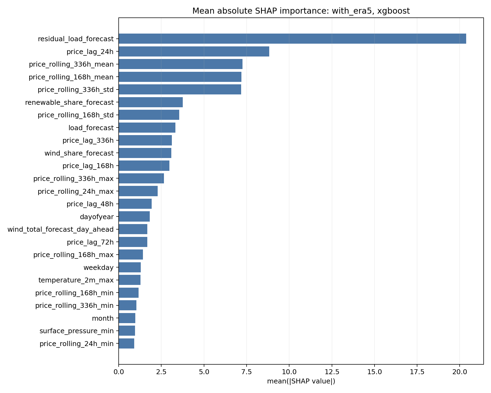
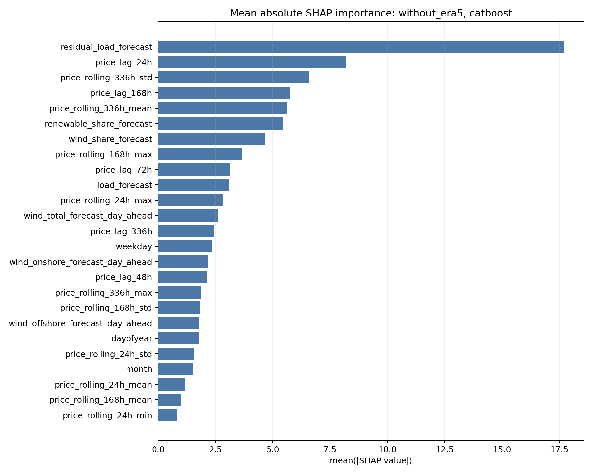

# ERA5 Ablation Max10 Visual Report

## Files

- Figure directory: `reports/figures/era5_ablation_max10/`
- Best-model prediction table: `reports/modeling/era5_ablation_max10_best_model_predictions.csv`
- SHAP importance tables:
  - `reports/modeling/era5_ablation_max10_shap_importance_with_era5_xgboost.csv`
  - `reports/modeling/era5_ablation_max10_shap_importance_without_era5_catboost.csv`
- Feature drift table: `reports/modeling/era5_ablation_max10_feature_drift_psi.csv`

## Main Figures

The full-year hourly plot is dense by design, so the short-window version below focuses on the last 240 hours of 2023.

## SHAP

SHAP summary plots use the standard color coding: red means high feature value, blue means low feature value.

## Feature Drift

The strongest drift is concentrated in historical price rolling statistics, especially rolling volatility and rolling mean/max features. This is consistent with 2023 having a different price regime from the 2019-2022 train/validation period.

## Initial Takeaways

- The best with-ERA5 model is XGBoost with MAE 19.1792.
- The best without-ERA5 model is CatBoost with MAE 19.1754.
- At the global yearly MAE level, these are effectively tied.
- SHAP for both models is dominated by market/fundamental variables: residual load forecast, price lags, rolling price statistics, renewable share, load forecast, and wind share.
- ERA5 may still matter in model-specific or scenario-specific ways. The next useful check is slicing performance by high wind, high solar, high residual load, negative price, and price spike periods.
